si # Plan de Desarrollo — Sistema de Gestión Administrativa (Cooperativa)

> Cliente: Ing. Katherine Martínez · Barquisimeto · Base: *Descripción del sistema a desarrollar-v01* y *Cotización sistema administrativo-v01*.
> Objetivo: sistema de gestión de socios (titulares y beneficiarios) para 3 servicios principales — **Ahorro, Funeraria, Salud** — más **Préstamos, Colecta/Caja, Bóveda, Cajero digital, Inventario, Citas, Asamblea y Mensajería**, con foco en **trazabilidad, eficiencia operativa y seguridad documental**.

---

## 1. Resumen ejecutivo

| Ítem | Detalle |
|---|---|
| Arquitectura | Orientada a servicios (SPA + API REST) |
| Frontend | ReactJS 18+ + TypeScript + React Router v6 + TanStack Query + Tailwind CSS + Shadcn/ui + Framer Motion + React Hook Form + Zod |
| Design System | Minimalista moderno · sistema de diseño cohesivo · tokens de diseño · componentes reutilizables · accesibilidad WCAG 2.1 AA |
| Backend | API REST (Node.js/Express) + ORM (Prisma/Sequelize) + capa de validación |
| Base de datos | PostgreSQL (trazabilidad y auditoría) |
| Cargas masivas | Importador Excel y TXT con validación y previsualización |
| Equipo | 2 programadores a tiempo completo |
| Duración V1 | 24 semanas calendario |
| Despliegue | Hosting provisto por el cliente; ambiente de prueba para UAT antes de producción |

**Alcance V1 (operativa fuerte):** Base del sistema (seguridad/auditoría/maestros) + Socios + Ahorro + Funeraria + Salud + Préstamos + Colecta/Caja + Bóveda + Reportes clave + Cajero digital.
**Fase 2 (posterior):** Inventario, Citas, Asamblea, Mensajería/Recordatorios y mejoras conversables (integraciones avanzadas, carnet con QR ampliado).

---

## 2. Principios de diseño UX/UI · Minimalismo moderno 2026

### 2.1. Filosofía de diseño

**Minimalismo funcional:** eliminar todo lo superfluo, mantener solo lo esencial para cada tarea. Cada elemento en pantalla debe tener un propósito claro.

**Principios fundamentales:**
- 🎯 **Clarity First** — la claridad es más importante que la novedad
- ⚡ **Zero Friction** — minimizar pasos y clics para tareas frecuentes
- 🧘 **Cognitive Load Reduction** — una cosa importante a la vez
- ♿ **Inclusive by Design** — accesible desde el primer día (WCAG 2.1 AA)
- 📱 **Progressive Enhancement** — funcional en cualquier dispositivo

### 2.2. Sistema de diseño (Design System)

**Paleta de colores moderna (2026):**
```
Primario:    Azul índigo suave (#4F46E5) — confianza, profesionalismo
Secundario:  Verde esmeralda (#10B981) — éxito, aprobaciones
Neutros:     Grises cálidos (#F9FAFB → #111827) — fondo, textos, bordes
Alertas:     Ámbar suave (#F59E0B) — advertencias
Errores:     Rojo coral (#EF4444) — errores, validaciones
Info:        Azul cielo (#0EA5E9) — notificaciones informativas
```

**Tipografía minimalista:**
- **Display/Headers:** Inter Variable (peso 600-700)
- **Body/UI:** Inter Variable (peso 400-500)
- **Números/Data:** JetBrains Mono (tabular nums, monoespaciada para alineación)
- **Escalas:** 12px, 14px, 16px (base), 18px, 24px, 32px, 48px

**Espaciado consistente (sistema 4px):**
- Base: 4px, 8px, 12px, 16px, 24px, 32px, 48px, 64px
- Aplicación: márgenes, padding, gaps entre elementos

**Elevación y profundidad (sutil):**
```
sm:  0 1px 2px 0 rgb(0 0 0 / 0.05)
md:  0 4px 6px -1px rgb(0 0 0 / 0.1)
lg:  0 10px 15px -3px rgb(0 0 0 / 0.1)
xl:  0 20px 25px -5px rgb(0 0 0 / 0.1)
```

**Bordes y radios:**
- `border-radius: 8px` (estándar moderno)
- `border-radius: 12px` (tarjetas principales)
- `border-radius: 6px` (botones, inputs)
- Bordes: 1px sólidos en tonos neutros claros

### 2.3. Componentes clave con UX moderna

#### Layout principal
- **Sidebar colapsable** con iconos + tooltips (vista compacta)
- **Header fijo** con breadcrumbs inteligentes, búsqueda global y perfil de usuario
- **Contenido con márgenes generosos** (max-width 1400px, centrado)
- **Dark mode opcional** (tema claro por defecto, toggle accesible)

#### Navegación
- **Menú contextual** por módulo (tabs secundarias cuando sea necesario)
- **Búsqueda global con Cmd+K** (spotlight-style)
- **Breadcrumbs dinámicos** que permiten navegación rápida

#### Formularios optimizados
- **Inputs con estados claros:** default, focus (ring azul), error, disabled
- **Validación en tiempo real** sin ser intrusiva (después del blur)
- **Mensajes de ayuda contextuales** (tooltips, hints inline)
- **Autofocus inteligente** en el primer campo
- **Loading states** en botones de submit
- **Campos agrupados lógicamente** con dividers sutiles

#### Tablas de datos modernas
- **Diseño limpio** sin líneas verticales (solo horizontales sutiles)
- **Row hover suave** con fondo highlight
- **Acciones contextuales** (iconos al hover, menú de 3 puntos)
- **Paginación + scroll infinito** (según volumen de datos)
- **Filtros avanzados colapsables** (no abrumar la interfaz)
- **Ordenamiento visual claro** (iconos de flechas)
- **Estados vacíos informativos** (empty states con ilustración + CTA)

#### Modales y overlays
- **Modales centrados** con backdrop blur sutil
- **Animación de entrada suave** (fade + scale)
- **Tamaños responsivos:** sm (400px), md (600px), lg (900px), full
- **Botón X visible** + cerrar con ESC
- **Acciones primarias/secundarias claras** (jerarquía visual)

#### Notificaciones (Toasts)
- **Posición:** top-right o top-center
- **Auto-dismiss** (4-6 segundos según tipo)
- **Colores semánticos** con iconos
- **Acción opcional** (deshacer, ver detalles)
- **Stack limit:** máximo 3 simultáneas

#### Cards y contenedores
- **Fondo blanco** con borde sutil o sombra suave
- **Padding generoso** (24px o más)
- **Información jerárquica:** título destacado, metadatos secundarios en gris
- **Separadores sutiles** entre secciones

### 2.4. Microinteracciones y feedback

**Animaciones sutiles (Framer Motion):**
- **Transiciones de página:** fade entre vistas (150ms)
- **Hover states:** scale(1.02) en botones, cards interactivos
- **Loading:** skeleton screens (preferir sobre spinners genéricos)
- **Listas:** stagger animation al cargar (delay 50ms entre items)
- **Success feedback:** checkmark animado + confetti sutil (operaciones importantes)

**Estados de carga:**
- **Skeleton screens** para contenido estructurado
- **Spinners minimalistas** para acciones breves
- **Progress bars** para procesos de varios pasos
- **Optimistic UI** cuando sea posible (actualizar UI antes de respuesta del servidor)

**Feedback inmediato:**
- **Botones:** ripple effect o pulse al click
- **Formularios:** validación visual instantánea (verde/rojo en bordes)
- **Acciones exitosas:** toast + animación de éxito
- **Errores:** toast + shake animation en el campo con error

### 2.5. UX específica para sistemas administrativos

#### Dashboard optimizado
- **KPIs destacados** en cards grandes (números grandes, tendencias con sparklines)
- **Gráficos minimalistas** (Chart.js o Recharts) sin decoración excesiva
- **Acciones rápidas** (quick actions) para tareas frecuentes
- **Últimas actividades** con timeline limpio

#### Ficha de socio (vista de 360°)
- **Header fijo** con foto, nombre, estado (badge) y acciones principales
- **Tabs laterales** para diferentes secciones (datos, servicios, historial, documentos)
- **Historial cronológico** con timeline visual
- **Indicadores de estado** claros (al día, moroso, suspendido)

#### Proceso de colecta diaria (flujo optimizado)
- **Búsqueda rápida de socio** (por cédula, nombre, código)
- **Vista previa** de deudas pendientes antes de cobrar
- **Captura rápida** de montos (teclado numérico, shortcuts)
- **Confirmación visual** de cobro exitoso
- **Impresión automática** de recibo

#### Gestión de préstamos
- **Wizard de varios pasos** (datos, montos, fiadores, confirmación)
- **Indicador de progreso** claro
- **Validaciones en cada paso** antes de avanzar
- **Resumen final** antes de aprobar
- **Plan de pagos visual** (tabla con estado de cada cuota)

### 2.6. Responsive design (mobile-first approach)

**Breakpoints:**
```
sm:  640px   — móvil horizontal
md:  768px   — tablet
lg:  1024px  — laptop
xl:  1280px  — desktop
2xl: 1536px  — pantallas grandes
```

**Adaptaciones clave:**
- **Sidebar → drawer** en móvil (hamburger menu)
- **Tablas → cards** en móvil (vista de lista)
- **Formularios en columna única** en móvil
- **Modales fullscreen** en móvil
- **Bottom navigation** para acciones principales en móvil

### 2.7. Accesibilidad (WCAG 2.1 AA)

**Contraste de colores:**
- Texto principal: ratio ≥ 4.5:1
- Texto grande (≥24px): ratio ≥ 3:1
- Componentes interactivos: ratio ≥ 3:1

**Navegación por teclado:**
- **Tab order lógico** en todos los formularios
- **Focus visible** (ring azul de 2-3px)
- **Skip links** para saltar al contenido principal
- **Shortcuts** documentados (Cmd+K, ESC, Enter)

**Semántica HTML:**
- Uso correcto de `<button>`, `<nav>`, `<main>`, `<aside>`, `<article>`
- **ARIA labels** en iconos sin texto
- **Alt text** descriptivo en imágenes
- **Labels asociados** a inputs con `for` + `id`

**Anuncios para lectores de pantalla:**
- **Live regions** para notificaciones
- **Status messages** en cambios de estado
- **Carga de contenido** anunciada

### 2.8. Tendencias 2026 aplicadas

- ✅ **Neumorfismo sutil** en botones principales (no exagerado)
- ✅ **Glassmorphism** en modales y overlays (backdrop-blur)
- ✅ **Gradient accents** sutiles (no gradientes chillones)
- ✅ **Ilustraciones minimalistas** para empty states
- ✅ **Iconografía consistente** (Lucide React o Heroicons)
- ✅ **Data visualization moderna** (gráficos limpios, colores limitados)
- ✅ **Modo oscuro opcional** (respetando preferencia del sistema)
- ✅ **Micro-copy amigable** (mensajes conversacionales, no técnicos)

### 2.9. Stack tecnológico UX/UI

```typescript
// UI Components & Styling
- Tailwind CSS v4         // Utility-first CSS
- Shadcn/ui              // Componentes accesibles base
- Radix UI               // Primitivos headless
- Framer Motion          // Animaciones fluidas

// Formularios
- React Hook Form        // Manejo de estado de formularios
- Zod                    // Validación de esquemas

// Data visualization
- Recharts o Chart.js    // Gráficos limpios

// Iconos
- Lucide React           // Iconografía moderna y consistente

// Utilidades
- clsx / tailwind-merge  // Gestión de clases condicionales
- date-fns               // Manejo de fechas
```

### 2.10. Checklist de calidad UX/UI por entregable

Antes de considerar una pantalla "terminada", verificar:

- [ ] Funciona correctamente en móvil (≤640px)
- [ ] Navegación por teclado completa (Tab, Enter, ESC)
- [ ] Contraste de colores AA (verificado con herramienta)
- [ ] Estados de loading visibles y no bloqueantes
- [ ] Mensajes de error claros y accionables
- [ ] Estados vacíos informativos (empty states)
- [ ] Animaciones sutiles y sin laggy
- [ ] Consistencia con design system (colores, espaciado, tipografía)
- [ ] Feedback inmediato en todas las interacciones
- [ ] Tooltips en iconos sin texto
- [ ] Performance: FCP < 1.5s, TTI < 3.5s

---

## 3. Estrategia y principios de ejecución

1. **Entrega incremental por módulos** con demos al cliente al cierre de cada fase.
2. **Reglas de negocio primero:** morosidad, suspensión, cálculo de tasa semanal, fiadores y conciliación deben quedar documentadas y aprobadas por el cliente antes de codificar el módulo correspondiente.
3. **UX/UI minimalista desde el día 1:** Design System definido en Fase 0, aplicado consistentemente en todas las entregas.
4. **Seguridad y auditoría transversales** desde la Fase 1 (no se agregan al final).
5. **Definición de "Terminado" (DoD)** por entregable: código + pruebas + validación de datos + revisión de seguridad (Codacy/Trivy) + checklist UX/UI aprobado + documentación mínima + demo aprobada.
6. **Ambientes:** `dev` (local) → `staging/prueba` (hosting cliente, UAT) → `producción`.

---

## 4. Fases del proyecto (cronograma 24 semanas)

```mermaid
gantt
    title Cronograma V1 (24 semanas, 2 programadores)
    dateFormat  W
    axisFormat  S%W
    section Fase 0
    Descubrimiento y diseño        :f0, 0, 2w
    section Fase 1
    Fundación técnica              :f1, after f0, 3w
    section Fase 2
    Socios y Servicios             :f2, after f1, 7w
    section Fase 3
    Operación financiera           :f3, after f2, 7w
    section Fase 4
    Cajero digital + hardening     :f4, after f3, 5w
```



| Fase | Nombre | Semanas | Foco |
|---|---|---|---|
| 0 | Descubrimiento + diseño | 2 | Reglas exactas, reportes, perfiles, prototipo |
| 1 | Fundación técnica | 3 | Login/roles/permisos, BD+API base, auditoría, maestros, motor de reportes/impresión |
| 2 | Núcleo de Socios y Servicios | 7 | Socios + beneficiarios + delegado + estados; Ahorro; Funeraria; Salud |
| 3 | Operación financiera fuerte | 7 | Préstamos + fiadores; Colecta/Caja completa; Bóveda; integraciones; carnet |
| 4 | Cajero digital + hardening | 5 | Conciliación pagos web/Italpago; seguridad, logs, backups, performance; QA + UAT |

---

## 5. Fase 0 — Descubrimiento y diseño (2 semanas)

**Objetivo:** cerrar reglas de negocio, alcance fino y prototipo navegable con Design System completo.

Entregables:
- **Documento de reglas de negocio** confirmado: morosidad (6 y 11 semanas), condiciones de suspensión/reactivación, cálculos de tasa semanal, reglas de fiador, criterios de morosidad de préstamos configurables.
- **Catálogo de reportes exactos** (campos, filtros, formato de salida PDF/Excel).
- **Matriz de roles y permisos** por módulo (Admin, Operador caja, Analista préstamos, Supervisor, Consulta).
- **Mapa de sucursales/cajas** (2 sucursales, 2 cajas globales, máquinas por oficina).
- **Modelo de datos preliminar (ERD)** y diccionario de datos.
- **Design System completo:** paleta de colores, tipografía, espaciado, componentes base (botones, inputs, cards, modales), guía de estilo.
- **Prototipo interactivo de alta fidelidad** (Figma) de pantallas principales: login, dashboard, menú, ficha de socio, colecta, préstamos.
- **Librería de componentes base** (Storybook): botones, inputs, tablas, modales según Design System.
- **Plan de integraciones** a validar: entidad bancaria, Italpago/Pago Móvil, SMS/WhatsApp (disponibilidad de API).

Criterio de aceptación: cliente aprueba reglas, reportes, Design System y prototipo interactivo.

---

## 6. Fase 1 — Fundación técnica (3 semanas)

Entregables:
- **Autenticación con UX moderna:** login animado, refresh token, recuperación de clave con wizard, y **roles/permisos por módulo**.
- **Layout minimalista completo:** sidebar colapsable, header fijo con breadcrumbs + búsqueda global (Cmd+K), dark mode toggle.
- **Componentes UI implementados** según Design System: botones, inputs, cards, modales, tablas, toasts, tooltips.
- **BD + API base**: CRUD genérico, paginación, filtros, manejo de errores estandarizado.
- **Auditoría/trazabilidad**: registro de quién creó/modificó y historial de cambios con timeline visual.
- **Catálogos Maestros (Parámetros):** tipos de movimientos, tipos de cuentas/libretas, acuerdos funeraria, acuerdos salud, ubicación/sucursal, tipos de préstamos, semana colecta (semana/año/divisa/ahorro/funeraria/salud). UI con tablas modernas, filtros, acciones contextuales.
- **Motor de reportes** (export PDF/Excel) con preview y **motor de impresión** (tickets, notas, carnet).
- **Dashboard base** con skeleton screens y KPIs de ejemplo.
- **Pipeline base:** repositorio, CI, análisis de calidad/seguridad (Codacy + Trivy), entornos dev/staging.

Criterio de aceptación: un usuario con rol puede autenticarse, navegar fluidamente, gestionar maestros con UX optimizada y generar un reporte de ejemplo con auditoría registrada. Cumple checklist UX/UI.

---

## 7. Módulos detallados (WBS)

Cada módulo indica **fase**, **funcionalidades**, **reportes**, **reglas/validaciones** y **consideraciones UX/UI específicas**.

### Módulo 0 — Base del sistema · (Fase 1) — *obligatorio*
- Autenticación + roles/permisos por módulo.
- Auditoría/trazabilidad (histórico de cambios).
- Catálogos maestros (parámetros).
- **DoD:** permisos aplicados en API y UI; toda operación de escritura auditada.

### Módulo 1 — Socios (núcleo transversal) · (Fase 2)
Funcionalidades:
- Registro / consulta / edición de **socio titular**.
- **Beneficiarios/Asociados** (hasta 9 por socio principal).
- **Estados:** activo / suspendido (2 modalidades: ≥6 semanas y ≥11 semanas de morosidad) y **reactivación** según reglamento.
- Marcado de socio como **delegado** (al registrar o modificar).
- Eliminación **lógica** y (conversable) física diferida.
- **Ficha del socio**: datos, servicios adquiridos, acuerdos, historial completo.
- Socios con 2–3 acuerdos: información completa y de fácil acceso.
Reportes:
- Listados de feria (activos por sucursal), listado de asociados.
Reglas/validaciones:
- Máx. 9 asociados; transiciones de estado según semanas de morosidad; auditoría de cambios de estado.
**UX/UI:**
- Formulario wizard en pasos (datos personales → beneficiarios → servicios → confirmación).
- Ficha de socio con tabs laterales y header fijo con foto.
- Estados con badges de colores semánticos (verde=activo, ámbar=advertencia, rojo=suspendido).
- Historial con timeline visual cronológico.
- Búsqueda de socio con autocompletado rápido (por cédula/nombre).

### Módulo 2 — Ahorro · (Fase 2)
Funcionalidades:
- Tipos de cuenta (ahorro y otras configurables por admin).
- Movimientos de ahorro; historial por fecha / tipo de cuenta / tipo de movimiento.
- Ahorro en **divisas y bolívares**.
- **Impresión de ticket** de transacción.
- **Impresión de carnet** (tamaño específico) con **código QR** *(mejora)*.
Reportes:
- Feria (activos por sucursal), asociados, **ahorro por socio con tipo de cuenta**, movimientos filtrados (fecha/tipo cuenta/tipo movimiento).
**UX/UI:**
- Historial de movimientos en tabla moderna con filtros avanzados colapsables.
- Indicador visual de saldo actual destacado (números grandes).
- Modal de confirmación antes de registrar movimientos importantes.
- Preview de ticket antes de imprimir.
- Formulario de captura rápida para movimientos frecuentes.

### Módulo 3 — Funeraria · (Fase 2)
Funcionalidades:
- Administrar **usuario que paga** por el servicio.
- **Acuerdos** por socio y **"Sociales"** (códigos de acuerdos por sucursal).
- **Búsqueda mejorada** (corrige fallas del sistema actual).
- **Traspaso** de servicio entre socios.
Reglas: un socio ahorrista puede tener funeraria y/o salud y/o los 3 servicios.

### Módulo 4 — Salud · (Fase 2)
Funcionalidades:
- Historia administrativa; muestra **derecho al servicio** (socio al día con el pago).
- **Carga masiva de pagos vía Excel** (importación con validación y previsualización).
Reglas: sin pago al día no hay derecho a servicio.

### Módulo 5 — Préstamos · (Fase 3)
Funcionalidades:
- Crear préstamo + **plan de pagos**/estado.
- Registrar **abonos** con **confirmación automática** con entidad bancaria *(integración/conciliación)*.
- Tipos de préstamos; **fiadores**.
- **Regla de fiador (mejora):** el fiador debe tener **disponibilidad/monto ahorrado**; el monto queda **restringido** por lo que avala; el fiador **indica el monto** que está dispuesto a fiar; sin aval suficiente el sistema **no aprueba** el préstamo.
Reportes:
- Préstamos por cobrar, cobrados, **morosos (criterios por tiempo, modificables)**, emitidos.
**UX/UI:**
- Wizard de creación de préstamo en 4 pasos con indicador de progreso.
- Validación de disponibilidad de fiador en tiempo real con feedback visual.
- Plan de pagos en tabla con estado de cada cuota (pagada, pendiente, vencida).
- Dashboard de préstamos con KPIs (total activos, morosos, tasa de morosidad) y gráfico de tendencias.
- Registro de abono con calculadora de monto y confirmación de pago.

### Módulo 6 — Colecta / Caja (operación diaria) · (Fase 3)
Funcionalidades:
- Cobros diarios a socios por servicio (ahorro/funeraria/salud/préstamos).
- **Tasa semanal**: al inicio de semana el operador ingresa la tasa del dólar y el sistema **recalcula automáticamente** los montos a cobrar.
- **Respaldo diario** de colecta de ahorro.
- Colecta funeraria / ahorro / salud / préstamos.
- **Cierre de caja global** (2 sucursales, diario) y **cierre de caja por oficina/máquina**.
- **Consolidado** (ahorro/salud/funeraria).
- **Colecta TXT** (carga de archivo txt).
- **Asiento contable**.
- **Colecta simple funeraria** y **salud** (nivelación de semanas de deuda del socio).
- Movimientos del día por socio: ahorro, préstamo, funeraria, salud.
- Otros: modificar, eliminar.
**UX/UI:**
- Interfaz optimizada para velocidad: búsqueda de socio con shortcuts de teclado.
- Vista previa de deudas pendientes en card destacado.
- Captura de montos con teclado numérico virtual y físico.
- Confirmación visual inmediata (animación de éxito + sonido opcional).
- Proceso de cierre de caja con checklist y validaciones automáticas.
- Dashboard de colecta del día con totales en tiempo real.
- Importador TXT con preview de datos y validación antes de confirmar.

### Módulo 7 — Bóveda · (Fase 3) — *mejora*
- Registro de **entradas/salidas** y **saldo** (mayormente divisas); actualizar monto incluido/restado.

### Módulo 8 — Cajero digital / Pagos web · (Fase 4)
Funcionalidades:
- Listado de personas que pagaron por la web.
- Listado de **usuario y clave digital** (mostrable al socio si lo solicita).
- **Cobros recibidos**.
- **Conciliación** (cantidad de personas, monto por banco y por caja).
- Integración **Italpago / Pago Móvil** (si hay API): registra y verifica pago.
- El **pago web actualiza el historial del socio automáticamente**.
- Mejora adicional *(conversable)*.

### Módulo 9 — Inventario · (Fase 2 opcional / posterior)
- Línea blanca; categorías; artículos; proveedores; compras.
- **Entregas** (productos entregados por préstamo o compra directa): imprimir **nota** con datos de la venta.
- Reportes: **inventario a costo**, **lista de precios de venta**.

### Módulo 10 — Citas · (Fase 2 posterior)
- Citas de nuevos socios desde la **web**; calendario; usuario.
- **Confirmación por mensaje** (SMS/WhatsApp) al teléfono.
- Listado de citados.

### Módulo 11 — Asamblea · (Fase 2 posterior)
- Registro de la información de asambleas realizadas.

### Módulo 12 — Recordatorios / Mensajería · (Fase 2 posterior)
- Recordatorios de morosidad (acercarse a oficina).
- **Mensaje masivo** (reuniones sectoriales, a todos los socios).
- **Mensaje a delegados**.

---

## 8. Reportes clave (consolidado)

| Módulo | Reporte |
|---|---|
| Socios/Ahorro | Feria (activos por sucursal), listado de asociados |
| Ahorro | Ahorro por socio con tipo de cuenta; movimientos filtrados |
| Préstamos | Por cobrar, cobrados, morosos (configurable), emitidos |
| Colecta/Caja | Cierres (global y por oficina), consolidado, movimientos del día por servicio, asiento contable |
| Cajero digital | Cobros recibidos, conciliación por banco/caja |
| Inventario | Inventario a costo, lista de precios de venta |

Formato: exportación **PDF/Excel** y salidas de impresión (tickets, notas, carnet con QR).

**Visualización moderna:**
- Reportes con preview en pantalla antes de exportar
- Gráficos y visualizaciones integrados (tendencias, comparativas)
- Exportación con branding de la cooperativa
- Tablas responsivas para visualización en cualquier dispositivo

---

## 9. Integraciones (validar disponibilidad de API en Fase 0)

- **Entidad bancaria** — confirmación automática de abonos de préstamos.
- **Italpago / Pago Móvil** — registro y verificación de pagos web.
- **SMS / WhatsApp** — confirmación de citas, recordatorios y mensajería masiva.

> Cada integración se desarrolla contra un **adaptador** desacoplado; si el proveedor no expone API, se define fallback manual (carga TXT/Excel o conciliación asistida).

---

## 10. Seguridad, calidad y datos (transversal)

- Autenticación con hash de contraseñas, control de sesión y **RBAC por módulo**.
- **Auditoría** de creación/modificación y trazabilidad documental.
- Validación de entrada en frontend y backend (evitar OWASP Top 10: inyección, control de acceso roto, etc.).
- Cargas masivas (Excel/TXT) con **validación + previsualización** antes de confirmar.
- **Backups** diarios (operativos y de BD) y respaldo de colecta.
- Análisis estático y de dependencias (Codacy + Trivy) en CI.
- Registro de logs y monitoreo de errores.
- **Performance:** optimización de consultas, lazy loading, code splitting, caching estratégico.

---

## 11. Fase 4 — Hardening, QA y entrega (5 semanas)

Entregables:
- Conciliación de pagos web (e Italpago si hay API).
- Endurecimiento de seguridad, control de errores, **logs, backups, performance**.
- **Optimización final de UX/UI:** auditoría de accesibilidad, pruebas en múltiples dispositivos, ajustes de animaciones.
- **QA final + UAT** en ambiente de prueba del hosting del cliente + ajustes.
- Documentación de entrega: credenciales/accesos, manual de operación, manual técnico, guía de Design System.
- Plan de mantenimiento del servidor *(adicional, conversable)*.

---

## 12. Estimación de esfuerzo por módulo

Base de capacidad: **2 programadores × 24 semanas = 48 semanas-persona (pw)**. Equivalencia usada: **1 pw ≈ 8 story points (SP)**. Prioridad: Alta (A) / Media (M) / Baja (B).

**Nota:** El esfuerzo de diseño UX/UI está incluido transversalmente en cada módulo (20-30% del tiempo de desarrollo frontend).

| Fase | Módulo / Trabajo | Semanas-persona | Story Points | Prioridad |
|---|---|---:|---:|:--:|
| 0 | Descubrimiento, reglas de negocio, ERD, Design System + prototipo interactivo | 4 | 32 | A |
| 1 | M0 Base: seguridad, roles/permisos, auditoría, maestros, motor reportes/impresión, CI | 6 | 48 | A |
| 2 | M1 Socios (titular, beneficiarios, estados, delegado, ficha) | 4 | 32 | A |
| 2 | M2 Ahorro (cuentas, movimientos, ticket, reportes) | 4 | 32 | A |
| 2 | M3 Funeraria (acuerdos, sociales, búsqueda, traspaso) | 3 | 24 | A |
| 2 | M4 Salud (derechos, historial, carga Excel) | 3 | 24 | A |
| 3 | M5 Préstamos (préstamo, abonos, fiadores, reportes) | 5 | 40 | A |
| 3 | M6 Colecta/Caja (tasa, cobros, cierres, consolidado, TXT, asientos) | 6 | 48 | A |
| 3 | M7 Bóveda (entradas/salidas, saldo) | 1 | 8 | M |
| 3 | Integraciones (banco/Italpago) + carnet QR | 2 | 16 | M |
| 4 | M8 Cajero digital + conciliación pagos web | 4 | 32 | A |
| 4 | Hardening (seguridad, logs, backups, performance) + QA + UAT | 6 | 48 | A |
| **Total V1** | | **48** | **384** | |

**Módulos de Fase 2 (posterior, fuera de las 24 semanas):**

| Módulo | Semanas-persona | Story Points | Prioridad |
|---|---:|---:|:--:|
| M9 Inventario (categorías, artículos, proveedores, compras, entregas, reportes) | 4 | 32 | M |
| M10 Citas (web, calendario, confirmación por mensaje, citados) | 3 | 24 | M |
| M11 Asamblea (registro de asambleas) | 1 | 8 | B |
| M12 Recordatorios / Mensajería (masivo, delegados, morosidad) | 2 | 16 | M |
| **Total Fase 2** | **10** | **80** | |

> Con 2 programadores, la Fase 2 posterior equivale a ~**5 semanas calendario** adicionales.

---

## 13. Desglose por sprint (V1 — 24 semanas)

Sprints de duración variable alineados a las fases. Total: 24 semanas.

| Sprint | Semanas | Fase | Foco / Entregable |
|:--:|:--:|:--:|---|
| S0 | 1–2 | 0 | Reglas de negocio aprobadas, catálogo de reportes, matriz de roles, ERD, Design System completo + prototipo interactivo |
| S1 | 3–5 | 1 | Login/roles/permisos, layout, BD+API base (CRUD), auditoría, maestros, motor reportes/impresión, CI |
| S2 | 6–7 | 2 | Socios: titular, beneficiarios (hasta 9), estados/suspensión, delegado, ficha del socio |
| S3 | 8–9 | 2 | Ahorro: tipos de cuenta, movimientos, ticket, historial; base de carnet |
| S4 | 10–12 | 2 | Funeraria (acuerdos, sociales, búsqueda, traspaso) + Salud (derechos, carga Excel) + reportes de ahorro |
| S5 | 13–14 | 3 | Préstamos: creación, plan de pagos, abonos, fiadores (reglas de disponibilidad), reportes |
| S6 | 15–16 | 3 | Colecta diaria por servicio, tasa semanal automática, movimientos del día por socio, respaldo diario |
| S7 | 17–18 | 3 | Cierres (global 2 sucursales y por oficina), consolidado, colecta simple, colecta TXT, asiento contable |
| S8 | 19 | 3 | Bóveda + carnet con QR + inicio integraciones (banco/Italpago) |
| S9 | 20–21 | 4 | Cajero digital: pagos web, usuarios/clave digital, cobros recibidos, conciliación, Italpago |
| S10 | 22–23 | 4 | Hardening: seguridad (OWASP), logs, backups, performance |
| S11 | 24 | 4 | QA final + UAT en hosting del cliente + ajustes + documentación y entrega |

**Cadencia por sprint:** planificación → desarrollo → pruebas + validación de datos → revisión de seguridad (Codacy/Trivy) → revisión checklist UX/UI → demo con el cliente → incorporación de feedback.

---

## 14. Entregables por fase (resumen)

| Fase | Entregables principales |
|---|---|
| 0 | Reglas de negocio aprobadas, catálogo de reportes, matriz de roles, ERD, Design System completo, prototipo interactivo |
| 1 | Login/roles/permisos con UX moderna, layout minimalista, componentes UI base, API+BD base, auditoría, maestros, motor de reportes/impresión, CI |
| 2 | Socios+beneficiarios+delegado+estados (con wizard y ficha optimizada), Ahorro, Funeraria, Salud (carga Excel con preview) |
| 3 | Préstamos+fiadores (wizard validado), Colecta/Caja completa (optimizada para velocidad), Bóveda, integraciones, carnet |
| 4 | Cajero digital+conciliación, hardening, optimización UX/UI final, QA+UAT, documentación y entrega |

---

## 15. Riesgos y supuestos

**Supuestos:** 2 programadores a tiempo completo; hosting provisto por el cliente; reglas de negocio y reportes se cierran en Fase 0; disponibilidad de APIs (banco/Italpago/SMS); Design System aprobado en Fase 0.

**Riesgos y mitigación:**
- Reglas de negocio ambiguas (morosidad, fiadores, tasa) → cerrar y firmar en Fase 0.
- Integraciones sin API disponible → fallback por carga TXT/Excel y conciliación asistida.
- Alcance creciente (Inventario/Citas/Asamblea/Mensajería) → gestionar como **Fase 2** fuera de las 24 semanas.
- Cambios en Design System durante desarrollo → control de cambios estricto, aprobación formal requerida.
- Performance en dispositivos móviles antiguos → pruebas desde Fase 1, optimizaciones progresivas.
- Calidad de datos en cargas masivas → validación + previsualización obligatoria.

---

## 15. Contacto

Ing. Katherine Martínez — kmgb5243@gmail.com — 0412-258.85.55
